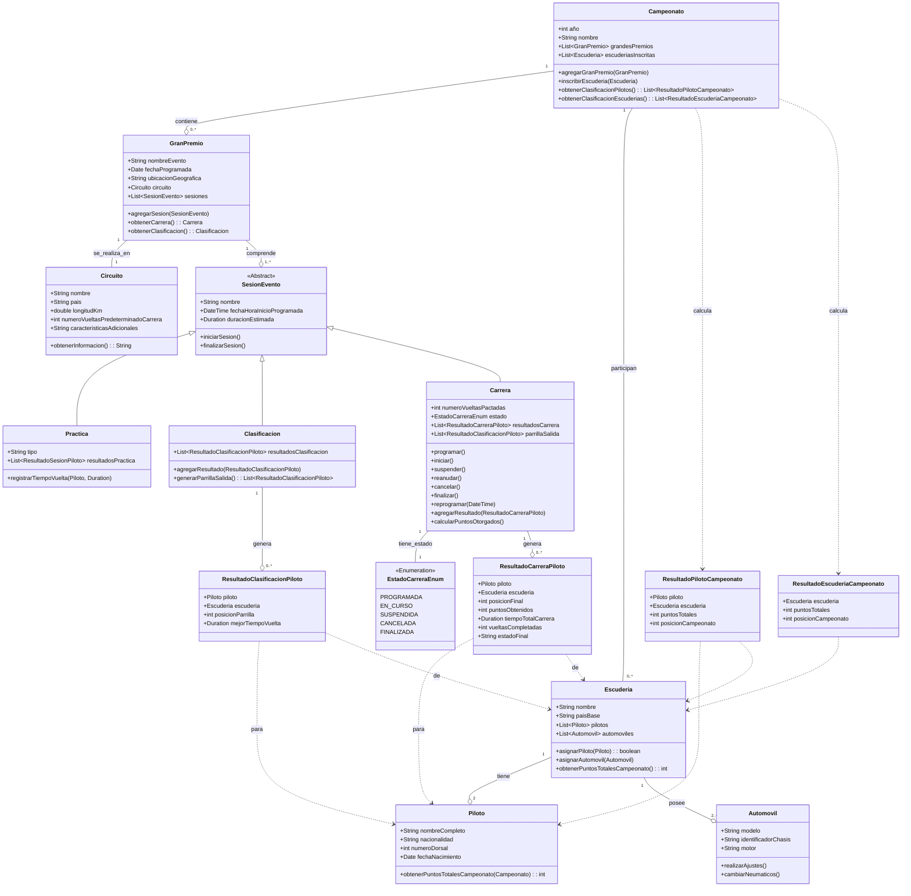

# Diseño Aplicación Gestión Fórmula Uno

## 1. Diagrama de Clases UML

### Clases y Descripciones:

#### `Campeonato`
*   **Descripción:** Representa una edición anual del campeonato.
*   **Atributos:**
    *   `año: int`
    *   `nombre: String`
    *   `grandesPremios: List<GranPremio>`
    *   `escuderiasInscritas: List<Escuderia>`
*   **Métodos:**
    *   `agregarGranPremio(gp: GranPremio): void`
    *   `inscribirEscuderia(escuderia: Escuderia): void`
    *   `obtenerClasificacionPilotos(): List<ResultadoPilotoCampeonato>`
    *   `obtenerClasificacionEscuderias(): List<ResultadoEscuderiaCampeonato>`
*   **Relaciones:**
    *   **Composición** con `GranPremio` (1 a Muchos): Un campeonato *se compone de* Grandes Premios.
    *   **Asociación** con `Escuderia` (1 a Muchos): Un campeonato *tiene* escuderías participantes.

#### `GranPremio`
*   **Descripción:** Representa un evento de fin de semana de carreras.
*   **Atributos:**
    *   `nombreEvento: String` (ej: "Gran Premio de Mónaco")
    *   `fechaProgramada: Date`
    *   `circuito: Circuito`
    *   `ubicacionGeografica: String`
    *   `sesiones: List<SesionEvento>`
*   **Métodos:**
    *   `agregarSesion(sesion: SesionEvento): void`
    *   `obtenerCarrera(): Carrera`
    *   `obtenerClasificacion(): Clasificacion`
*   **Relaciones:**
    *   **Asociación** con `Circuito` (Muchos a 1): Un GP *se realiza en* un `Circuito`.
    *   **Composición** con `SesionEvento` (1 a Muchos): Un GP *se compone de* varias sesiones.

#### `Circuito`
*   **Descripción:** La pista física donde se realiza un Gran Premio.
*   **Atributos:**
    *   `nombre: String`
    *   `pais: String`
    *   `longitudKm: double`
    *   `numeroVueltasPredeterminadoCarrera: int`
    *   `caracteristicasAdicionales: String`
*   **Métodos:**
    *   `obtenerInformacion(): String`

#### `SesionEvento` (Clase Abstracta)
*   **Descripción:** Clase base para los diferentes tipos de sesiones en un Gran Premio.
*   **Atributos:**
    *   `nombre: String`
    *   `fechaHoraInicioProgramada: DateTime`
    *   `duracionEstimada: Duration`
*   **Métodos:**
    *   `iniciarSesion(): void` (puede ser abstracto)
    *   `finalizarSesion(): void` (puede ser abstracto)
*   **Relaciones:**
    *   **Generalización:** Superclase de `Practica`, `Clasificacion`, `Carrera`.
    *   *Justificación:* Permite tratar todas las sesiones de forma polimórfica y reutilizar atributos comunes.

#### `Practica` (Hereda de `SesionEvento`)
*   **Descripción:** Sesión de práctica libre.
*   **Atributos:**
    *   `tipo: String` (ej: "Libre 1", "Libre 2")
    *   `resultadosPractica: List<ResultadoSesionPiloto>` (opcional)
*   **Métodos:**
    *   `registrarTiempoVuelta(piloto: Piloto, tiempo: Duration): void`

#### `Clasificacion` (Hereda de `SesionEvento`)
*   **Descripción:** Sesión para determinar la parrilla de salida.
*   **Atributos:**
    *   `resultadosClasificacion: List<ResultadoClasificacionPiloto>`
*   **Métodos:**
    *   `agregarResultado(resultado: ResultadoClasificacionPiloto): void`
    *   `generarParrillaSalida(): List<ResultadoClasificacionPiloto>`
*   **Relaciones:**
    *   **Composición** con `ResultadoClasificacionPiloto` (1 a Muchos).

#### `Carrera` (Hereda de `SesionEvento`)
*   **Descripción:** El evento principal donde se otorgan puntos.
*   **Atributos:**
    *   `numeroVueltasPactadas: int`
    *   `estado: EstadoCarreraEnum`
    *   `resultadosCarrera: List<ResultadoCarreraPiloto>`
    *   `parrillaSalida: List<ResultadoClasificacionPiloto>`
*   **Métodos:**
    *   `programar(): void`
    *   `iniciar(): void`
    *   `suspender(): void`
    *   `reanudar(): void`
    *   `cancelar(): void`
    *   `finalizar(): void`
    *   `reprogramar(nuevaFechaHora: DateTime): void`
    *   `agregarResultado(resultado: ResultadoCarreraPiloto): void`
    *   `calcularPuntosOtorgados(): void`
*   **Relaciones:**
    *   **Composición** con `ResultadoCarreraPiloto` (1 a Muchos).
    *   **Asociación** con `EstadoCarreraEnum`.

#### `EstadoCarreraEnum` (Enumeración)
*   **Descripción:** Estados posibles de una carrera.
*   **Valores:** `PROGRAMADA`, `EN_CURSO`, `SUSPENDIDA`, `CANCELADA`, `FINALIZADA`.

#### `Escuderia`
*   **Descripción:** Un equipo que compite en el campeonato.
*   **Atributos:**
    *   `nombre: String`
    *   `paisBase: String`
    *   `pilotos: List<Piloto>` (Exactamente 2)
    *   `automoviles: List<Automovil>` (Al menos 2)
*   **Métodos:**
    *   `asignarPiloto(piloto: Piloto): boolean`
    *   `asignarAutomovil(automovil: Automovil): void`
    *   `obtenerPuntosTotalesCampeonato(): int`
*   **Relaciones:**
    *   **Composición** con `Piloto` (1 a 2): Una escudería *se compone de* dos pilotos.
    *   **Composición** con `Automovil` (1 a Muchos): Los autos *pertenecen a* la escudería.
    *   *Justificación Composición:* Pilotos y Automóviles son partes integrales de la escudería; su existencia en el contexto de la competición depende de la escudería.

#### `Piloto`
*   **Descripción:** Un conductor que compite para una escudería.
*   **Atributos:**
    *   `nombreCompleto: String`
    *   `nacionalidad: String`
    *   `numeroDorsal: int`
    *   `fechaNacimiento: Date`
*   **Métodos:**
    *   `obtenerPuntosTotalesCampeonato(campeonato: Campeonato): int`

#### `Automovil`
*   **Descripción:** El vehículo de Fórmula 1.
*   **Atributos:**
    *   `modelo: String`
    *   `identificadorChasis: String`
    *   `motor: String`
*   **Métodos:**
    *   `realizarAjustes(): void`
    *   `cambiarNeumaticos(): void`

#### `ResultadoClasificacionPiloto`
*   **Descripción:** Resultado de un piloto en una sesión de clasificación.
*   **Atributos:**
    *   `piloto: Piloto`
    *   `escuderia: Escuderia`
    *   `posicionParrilla: int`
    *   `mejorTiempoVuelta: Duration`
*   **Relaciones:**
    *   **Asociación** con `Piloto` (1 a 1, en el contexto de esta clasificación específica).
    *   **Asociación** con `Escuderia` (1 a 1, en el contexto de esta clasificación específica).

#### `ResultadoCarreraPiloto`
*   **Descripción:** Resultado de un piloto en una carrera.
*   **Atributos:**
    *   `piloto: Piloto`
    *   `escuderia: Escuderia`
    *   `posicionFinal: int`
    *   `puntosObtenidos: int`
    *   `tiempoTotalCarrera: Duration`
    *   `vueltasCompletadas: int`
    *   `estadoFinal: String` (ej: "Terminó", "DNF", "DSQ")
*   **Relaciones:**
    *   **Asociación** con `Piloto` (1 a 1, en el contexto de esta carrera específica).
    *   **Asociación** con `Escuderia` (1 a 1, en el contexto de esta carrera específica).

#### `ResultadoPilotoCampeonato` (DTO/Clase de datos)
*   **Descripción:** Agrega los resultados de un piloto para el campeonato.
*   **Atributos:**
    *   `piloto: Piloto`
    *   `escuderia: Escuderia`
    *   `puntosTotales: int`
    *   `posicionCampeonato: int`
*   **Relaciones:**
    *   **Asociación** con `Piloto`.
    *   **Asociación** con `Escuderia`.

#### `ResultadoEscuderiaCampeonato` (DTO/Clase de datos)
*   **Descripción:** Agrega los resultados de una escudería para el campeonato.
*   **Atributos:**
    *   `escuderia: Escuderia`
    *   `puntosTotales: int`
    *   `posicionCampeonato: int`
*   **Relaciones:**
    *   **Asociación** con `Escuderia`.

### Diagrama en Mermaid:

---

## 2. Máquina de Estados UML para la clase `Carrera`

Identifica los estados y transiciones para el ciclo de vida de un objeto `Carrera`.

### Estados Posibles:

1.  **`Programada`**: Estado inicial. La carrera está agendada pero no ha comenzado.
2.  **`EnCurso`**: La carrera ha comenzado y está activa.
3.  **`Suspendida`**: La carrera ha sido interrumpida temporalmente.
4.  **`Cancelada`**: La carrera no se llevará a cabo o no continuará.
5.  **`Finalizada`**: La carrera ha concluido normalmente.

### Transiciones (Evento / [Guarda] / Acción):

*   **Creación de Carrera:**
    *   Evento: `crearCarrera()` (Constructor o método de fábrica)
    *   Acción: `carrera.estado = PROGRAMADA`
    *   Estado Destino: `Programada`

*   **De `Programada` a `EnCurso`:**
    *   Evento Disparador: `iniciar()`
    *   Acciones: Registrar hora de inicio real, actualizar estado a `EN_CURSO`.

*   **De `Programada` a `Suspendida`:**
    *   Evento Disparador: `suspender()`
    *   Condición de Guarda: `[condicionesImpidenInicio]` (ej: clima adverso antes de la salida)
    *   Acciones: Notificar suspensión, actualizar estado a `SUSPENDIDA`.

*   **De `Programada` a `Cancelada`:**
    *   Evento Disparador: `cancelar()`
    *   Condición de Guarda: `[decisionOficialAntesInicio]` (ej: desastre natural)
    *   Acciones: Notificar cancelación, actualizar estado a `CANCELADA`.

*   **De `Programada` a `Programada` (Reprogramación):**
    *   Evento Disparador: `reprogramar(nuevaFechaHora)`
    *   Acciones: Actualizar `fechaHoraInicioProgramada` a `nuevaFechaHora`, notificar reprogramación. (El estado sigue siendo `PROGRAMADA` pero con nueva fecha).

*   **De `EnCurso` a `Suspendida`:**
    *   Evento Disparador: `suspender()`
    *   Condición de Guarda: `[condicionesAdversasDuranteCarrera]` (ej: accidente, bandera roja)
    *   Acciones: Registrar estado actual (vuelta, etc.), notificar suspensión, actualizar estado a `SUSPENDIDA`.

*   **De `EnCurso` a `Finalizada`:**
    *   Evento Disparador: `finalizar()`
    *   Condición de Guarda: `[vueltasCompletadas O tiempoMaximoAlcanzado]`
    *   Acciones: Registrar resultados finales, calcular puntos, notificar finalización, actualizar estado a `FINALIZADA`.

*   **De `Suspendida` a `EnCurso` (Reanudación):**
    *   Evento Disparador: `reanudar()`
    *   Condición de Guarda: `[condicionesMejoran]`
    *   Acciones: Notificar reanudación, actualizar estado a `EN_CURSO`.

*   **De `Suspendida` a `Cancelada`:**
    *   Evento Disparador: `cancelar()`
    *   Condición de Guarda: `[imposibleContinuar]` (las condiciones no mejoran)
    *   Acciones: Notificar cancelación definitiva, actualizar estado a `CANCELADA`.

*   **De `Suspendida` a `Programada` (Reprogramación desde suspensión):**
    *   Evento Disparador: `reprogramar(nuevaFechaHora)`
    *   Condición de Guarda: `[calendarioPermite]` (se decide no continuar hoy, pero se reprograma)
    *   Acciones: Actualizar `fechaHoraInicioProgramada` a `nuevaFechaHora`, notificar reprogramación, actualizar estado a `PROGRAMADA`.

### Diagrama de Máquina de Estados en Mermaid:

