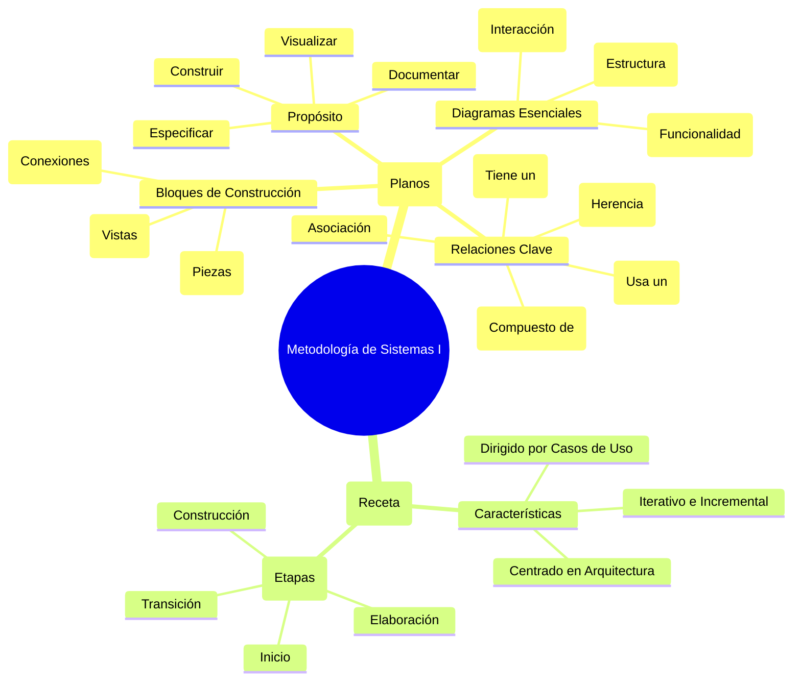

# Guía de Estudio de Alto Impacto: Metodología de Sistemas I

## 1. La Idea Central (en un Tweet)

> UML es el "plano" para construir software, usando diagramas para visualizar su estructura (Clases) y comportamiento (Casos de Uso). El Proceso Unificado (PUD) es la "metodología de construcción" que organiza el proyecto en fases usando estos planos.

## 2. Mapa Mental / Esquema Jerárquico

### Mapa Mental (Visual)



### Esquema Jerárquico (Texto)

*   **I. UML (Lenguaje Unificado de Modelado) - El "Qué" y el "Cómo" se dibuja**
    *   **Propósito:** No es una metodología, es un LENGUAJE para:
        *   **Visualizar:** Hacer gráficos que todos entiendan.
        *   **Especificar:** Detallar el sistema sin ambigüedad.
        *   **Construir:** Generar código a partir de los modelos.
        *   **Documentar:** Dejar constancia de la arquitectura y decisiones.
    *   **Bloques de Construcción de UML:**
        *   **Elementos:** Las "piezas" del sistema (Clase, Componente, Nodo, Caso de Uso).
        *   **Relaciones (¡MUY IMPORTANTE!):** Las "conexiones" entre piezas.
            *   **Dependencia:** Una clase "usa" a otra (`-->`).
            *   **Asociación:** Una clase se "relaciona con" otra.
            *   **Agregación:** "Tiene un" (partes pueden existir solas. Rombo hueco `o--`).
            *   **Composición:** "Está compuesto de" (partes no existen sin el todo. Rombo relleno `*--`).
            *   **Generalización (Herencia):** "Es un tipo de" (triángulo hueco `<|--`).
        *   **Diagramas:** Los "planos" del sistema.
            *   **Estructurales:** Diagrama de Clases, Componentes, Despliegue.
            *   **De Comportamiento:** Diagrama de Casos de Uso, Secuencia, Actividad.

*   **II. PUD (Proceso Unificado de Desarrollo) - La "Receta" para construir**
    *   **Características Principales:**
        *   **Dirigido por Casos de Uso:** Se centra en lo que el usuario necesita.
        *   **Centrado en la Arquitectura:** Primero se define el esqueleto del sistema.
        *   **Iterativo e Incremental:** Se construye en pequeños ciclos.
    *   **Estructura del PUD:**
        *   **Fases:** Inicio, Elaboración, Construcción, Transición.
        *   **Flujos de Trabajo:** Requisitos, Análisis, Diseño, Implementación y Prueba.

## 3. Explicación Feynman para Dummies

Imagina que vamos a construir una casa:

*   **UML es el conjunto de planos.** No es el proceso de construir, sino el lenguaje con el que dibujamos los planos. Un plano es un `Diagrama`.

    *   **Diagrama de Clases (Plano de Materiales):** Te dice de qué está hecha la casa. Una `Clase` es la "receta" de una pared. La **Composición** es clave: la `Habitacion` "está compuesta de" `Paredes`. Si demueles la habitación, las paredes desaparecen con ella. La **Agregación** sería: la `Casa` "tiene un" `Garaje`. Puedes demoler la casa y el garaje sigue ahí.

        ```mermaid
        classDiagram
            class Casa {
                +direccion: string
            }
            class Habitacion
            class Pared
            class Garaje

            Casa "1" *-- "1..*" Habitacion : esta compuesta de
            Habitacion "1" *-- "4" Pared : esta compuesta de
            Casa "1" o-- "0..1" Garaje : tiene un
        ```

    *   **Diagrama de Casos de Uso (Plano de Funcionalidad):** Te dice qué puedes hacer en la casa. Un `Actor` (una persona) puede realizar un `Caso de Uso` (ej: "Cocinar Comida").

        ```mermaid
        graph TD
            actor((👤<br>Persona))
            
            subgraph Sistema de la Casa
                uc1(Cocinar Comida)
                uc2(Ver Televisión)
            end
            
            actor --> uc1
            actor --> uc2
        ```
    
    *   **Diagrama de Secuencia (Manual de Instrucciones paso a paso):** Te dice el orden exacto de las cosas. Para "Hacer Café", el Actor (tú) interactúa con la Cafetera.
    
        ```mermaid
        sequenceDiagram
            actor Tu
            participant Cafetera
            
            Tu->>Cafetera: 1. Presionar botón
            activate Cafetera
            Cafetera-->>Cafetera: 2. Calentar agua
            Cafetera->>Tu: 3. Servir café
            deactivate Cafetera
        ```

*   **PUD es el plan de construcción del arquitecto.** Es el método de trabajo:
    1.  **Inicio:** ¿Es viable el proyecto?
    2.  **Elaboración:** Hacemos los planos importantes (la estructura).
    3.  **Construcción:** Construimos la casa habitación por habitación (iteraciones).
    4.  **Transición:** Te entrego las llaves.

## 4. Glosario de Supervivencia

1.  **UML (Lenguaje Unificado de Modelado):** El estándar gráfico (el lenguaje de los planos) para visualizar, especificar, construir y documentar software.
2.  **PUD (Proceso Unificado de Desarrollo):** La metodología (la receta) para gestionar un proyecto de software de forma iterativa, incremental y centrada en la arquitectura.
3.  **Clase:** La plantilla o "receta" para crear objetos. Define atributos (datos) y métodos (comportamientos).
4.  **Actor:** Alguien o algo (un usuario, otro sistema) que interactúa con nuestro sistema.
5.  **Caso de Uso:** Una funcionalidad específica que el sistema ofrece a un actor. Describe un "qué hace" el sistema (Ej: "Registrar Usuario").
6.  **Composición:** La relación "todo-parte" más fuerte. La parte no puede existir sin el todo. Se representa con un rombo relleno (`*--`). (Ej: Una `Factura` y sus `LineasDeFactura`).
7.  **Diagrama de Secuencia:** Diagrama que muestra la interacción entre objetos ordenada en el tiempo. Esencial para entender el comportamiento dinámico.

## 5. Batería de Preguntas para Memorizar (Recuperación Activa)

*Usa esta sección para autoevaluarte. Lee la pregunta, intenta responderla y luego verifica tu respuesta.*

1.  ¿Qué es UML y cuál es su propósito principal?
2.  ¿Qué es el PUD y cuáles son sus 3 características clave?
3.  ¿Cuál es la diferencia fundamental entre Agregación y Composición? Da un ejemplo para cada una.
4.  ¿Qué muestra un Diagrama de Clases?
5.  ¿Qué muestra un Diagrama de Casos de Uso?
6.  ¿Qué es un Actor en el contexto de UML?
7.  ¿Para qué sirve un Diagrama de Secuencia?
8.  ¿Qué representa una relación de Generalización (Herencia)?
9.  Nombra las 4 fases del Proceso Unificado (PUD).
10. ¿Qué significa que el PUD es "iterativo e incremental"?
11. En un Diagrama de Casos de Uso, ¿qué diferencia hay entre una relación `<<include>>` y una `<<extend>>`?
12. ¿Qué es un "paquete" en UML?
13. ¿Qué información te da la "multiplicidad" en una asociación de un Diagrama de Clases?
14. ¿Qué muestra un Diagrama de Despliegue?
15. ¿Qué muestra un Diagrama de Actividad?

---

### RESPUESTAS

1.  **UML** es un lenguaje gráfico estándar para modelar sistemas de software. Su propósito es visualizar, especificar, construir y documentar el sistema.
2.  **PUD** es una metodología de desarrollo de software. Sus 3 características son: 1) Dirigido por casos de uso, 2) Centrado en la arquitectura, y 3) Iterativo e incremental.
3.  Ambas son relaciones "todo-parte". En la **Agregación**, la parte PUEDE existir sin el todo (ej: un Equipo y sus Jugadores). En la **Composición**, la parte NO PUEDE existir sin el todo (ej: un Coche y su Motor).
4.  Un **Diagrama de Clases** muestra la estructura estática del sistema: las clases, sus atributos, métodos y las relaciones entre ellas.
5.  Un **Diagrama de Casos de Uso** muestra la funcionalidad del sistema desde la perspectiva del usuario: los actores, los casos de uso y cómo interactúan.
6.  Un **Actor** es un rol que juega un usuario, un dispositivo de hardware u otro sistema al interactuar con nuestro sistema.
7.  Un **Diagrama de Secuencia** muestra la interacción entre un conjunto de objetos a lo largo del tiempo, mostrando los mensajes que se envían y en qué orden.
8.  Una **Generalización (Herencia)** representa una relación "es un tipo de", donde una clase hija (subclase) hereda los atributos y comportamientos de una clase padre (superclase).
9.  Las 4 fases del PUD son: **Inicio, Elaboración, Construcción y Transición.**
10. **Iterativo e incremental** significa que el software se construye en ciclos cortos (iteraciones). En cada ciclo, se añade una pequeña porción de nueva funcionalidad (un incremento) al producto.
11. **`<<include>>`** es para funcionalidad obligatoria y reutilizada (ej: "Verificar Login" se incluye en "Comprar"). **`<<extend>>`** es para funcionalidad opcional (ej: "Aplicar Cupón" extiende "Pagar Compra").
12. Un **Paquete** es un mecanismo de agrupación, como una carpeta, que sirve para organizar los elementos del modelo UML.
13. La **multiplicidad** indica cuántos objetos de una clase pueden estar relacionados con un objeto de la otra clase (ej: `1`, `*` (muchos), `0..1`).
14. Un **Diagrama de Despliegue** muestra la arquitectura física del sistema: en qué servidores (nodos) se ejecutarán los componentes de software.
15. Un **Diagrama de Actividad** muestra el flujo de trabajo de un proceso, similar a un diagrama de flujo.